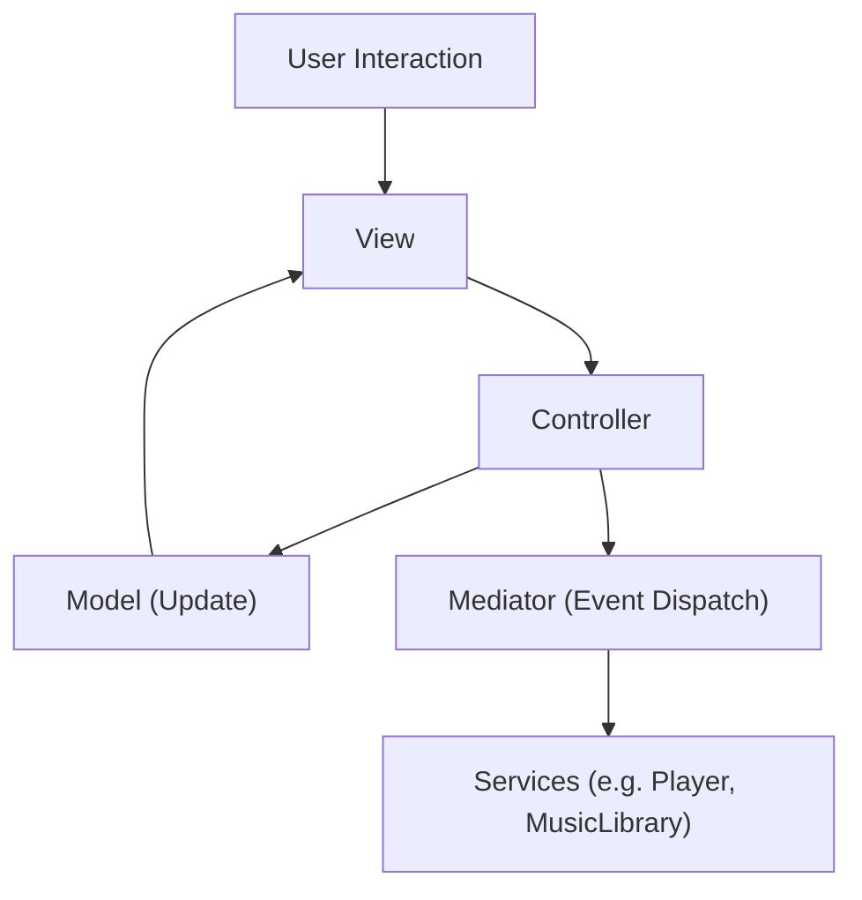

# 🛠 Technical Architecture

This section outlines the internal structure of **Audio-256**, including project structure, core components, views.

---

## 📚 Table of Contents

- 🧩 [MVC Architecture Pattern](#-mvc-architecture-pattern)
    - ✳️ [Overview](#️-overview)
    - 🧱 [Example Breakdown (AlbumTracks module)](#-example-breakdown)
    - 🔁 [Interaction Flow](#-interaction-flow)
- 📁 [Project Structure](#-project-structure)
- 🛠 [App Classes](#-app-classes)
- 📦 [Core Classes](#-core-classes)
- 🖼 [Forms / Views](#-forms--views)
- 🗂 [Data Structure](#-data-structure)
- 📦 [External Libraries](#-external-libraries)
- 🛠 [Build & Run](#-build--run)

---

## 🧩 MVC Architecture Pattern

**Audio-256** adopts a Modular MVC (Model–View–Controller) pattern enhanced with a Mediator Pattern, promoting clear separation of concerns, high modularity, and scalable communication between decoupled components.

### ✳️ Overview
| Layer              | Role                                                                                                                                              |
| ------------------ | ------------------------------------------------------------------------------------------------------------------------------------------------- |
| **Model (M)**      | Stores UI-specific data and state (e.g., current album, track list, volume level).                                                                |
| **View (V)**       | Defines the visual layout and behavior. Reacts to UI events and binds to the model for data updates.                                              |
| **Controller (C)** | Handles business logic, user interaction, and coordination between Model and View. Communicates with services through `MediatorPattern`.          |
| **Mediator**       | Decouples Views, Controllers, and Services by acting as an event/message dispatcher across the app. Enables scalable, event-driven communication. |

---

### 🧱 Example Breakdown (AlbumTracks module)

| File                           | Responsibility                                                                               |
| ------------------------------ | -------------------------------------------------------------------------------------------- |
| `AlbumTracksViewModel.cs`      | Holds selected album, track list, playback selection, and UI state                           |
| `AlbumTracksView.cs`           | Displays album info and renders list of tracks; triggers interaction events                  |
| `AlbumTracksViewController.cs` | Loads album data from `MusicLibrary`, updates model, responds to user input via the Mediator |

---

### 🔁 Interaction Flow



---

1. The View captures a UI event (e.g. user clicks "Play").
2. The Controller handles the input, updates the Model, and sends an event via the Mediator.
3. The Mediator dispatches the event to the appropriate service (Player, MusicLibrary, etc.).
4. The Model changes, triggering the View to update its display accordingly.

---

## 📁 Project Structure

```plaintext
Audio256/
│
├── App/                                   
│   ├── AppInitializer.cs
│   ├── Program.cs
│   └── Resources/                         
│       └── ...
│
├── Core/                                  
│   ├── Player.cs
│   ├── MusicLibrary.cs
│   ├── MetadataHelper.cs
│   ├── LibraryLoader.cs
│   └── MediatorPattern.cs   
│
└── UI/                                    
    │
    ├── MainForm/
    │   ├── Models/
    │   │   └── MainFormModel.cs
    │   ├── Views/
    │   │   └── MainFormView.cs
    │   └── Controllers/
    │       └── MainFormController.cs
    │
    ├── Shared/                            
    │   ├── NavBar/
    │   │   ├── Models/
    │   │   │   └── NavBarModel.cs
    │   │   ├── Views/
    │   │   │   └── NavBarView.cs
    │   │   └── Controllers/
    │   │       └── NavBarController.cs
    │   │
    │   ├── PlayerControlBar/
    │   │   ├── PlayerHeader/
    │   │   │   ├── Models/
    │   │   │   │   └── PlayerHeaderModel.cs
    │   │   │   ├── Views/
    │   │   │   │   └── PlayerHeaderView.cs
    │   │   │   └── Controllers/
    │   │   │        └── PlayerHeaderController.cs
    │   │   │  
    │   │   ├── PlayerBar/
    │   │   │   ├── Models/
    │   │   │   │   └── PlayerBarModel.cs
    │   │   │   ├── Views/
    │   │   │   │   └── PlayerBarView.cs
    │   │   │   └── Controllers/
    │   │   │        └── PlayerBarController.cs
    │   │   │
    │   │   └── SoundBar/
    │   │       ├── Models/
    │   │       │   └── SoundBarModel.cs
    │   │       ├── Views/
    │   │       │   └── SoundBarView.cs
    │   │       └── Controllers/
    │   │           └── SoundBarController.cs
    │   │
    │   └── SystemTrayIcon/
    │       ├── Models/
    │       │   └── SystemTrayIconModel.cs
    │       ├── Views/
    │       │   └── SystemTrayIconView.cs
    │       └── Controllers/
    │           └── SystemTrayIconController.cs
    │
    ├── Artists/
    │   ├── Models/
    │   │   ├── ArtistsViewModel.cs
    │   │   └── ArtistListThumbnailModel.cs
    │   ├── Views/
    │   │   ├── ArtistsView.cs
    │   │   └── ArtistListThumbnailView.cs
    │   └── Controllers/
    │       ├── ArtistsViewController.cs
    │       └── ArtistListThumbnailController.cs
    │
    ├── Albums/
    │   ├── Models/
    │   │   ├── AlbumsViewModel.cs
    │   │   └── AlbumListThumbnailModel.cs
    │   ├── Views/
    │   │   ├── AlbumsView.cs
    │   │   └── AlbumListThumbnailView.cs
    │   └── Controllers/
    │       ├── AlbumsViewController.cs
    │       └── AlbumListThumbnailController.cs
    │
    ├── ArtistAlbums/
    │   ├── Models/
    │   │   ├── ArtistAlbumsViewModel.cs
    │   │   └── ArtistAlbumThumbnailModel.cs
    │   ├── Views/
    │   │   ├── ArtistAlbumsView.cs
    │   │   └── ArtistAlbumThumbnailView.cs
    │   └── Controllers/
    │       ├── ArtistAlbumsViewController.cs
    │       └── ArtistAlbumThumbnailController.cs
    │   
    ├── AlbumTracks/
    │   ├── Models/
    │   │   ├── AlbumTracksViewModel.cs
    │   │   ├── AlbumTracksHeaderModel.cs
    │   │   ├── AlbumTracksListModel.cs
    │   │   └── AlbumTrackItemModel.cs
    │   ├── Views/
    │   │   ├── AlbumTracksView.cs
    │   │   ├── AlbumTracksHeaderView.cs
    │   │   ├── AlbumTracksListView.cs
    │   │   └── AlbumTrackView.cs
    │   └── Controllers/
    │       ├── AlbumTracksViewController.cs
    │       ├── AlbumTracksHeaderController.cs
    │       ├── AlbumTracksListController.cs
    │       └── AlbumTrackController.cs
    │
    ├── Playlist/
    │   ├── Models/
    │   │   ├── PlaylistViewModel.cs
    │   │   ├── PlaylistCreateButtonModel.cs
    │   │   └── PlaylistThumbnailModel.cs
    │   ├── Views/
    │   │   ├── PlaylistView.cs
    │   │   ├── PlaylistCreateButtonView.cs
    │   │   └── PlaylistThumbnailView.cs
    │   └── Controllers/
    │       ├── PlaylistViewController.cs
    │       ├── PlaylistCreateButtonController.cs
    │       └── PlaylistThumbnailController.cs
    │
    └── PlaylistTracks/
        ├── Models/
        │   ├── PlaylistTracksViewModel.cs
        │   ├── PlaylistTrackItemModel.cs
        │   ├── PlaylistHeaderModel.cs
        │   ├── PlaylistListModel.cs
        │   ├── PlaylistSearchTrackItemModel.cs
        │   └── PlaylistSearchBoxModel.cs
        ├── Views/
        │   ├── PlaylistTracksView.cs
        │   ├── PlaylistTrackItemView.cs
        │   ├── PlaylistHeaderView.cs
        │   ├── PlaylistListView.cs
        │   ├── PlaylistSearchTrackItemView.cs
        │   └── PlaylistSearchBoxView.cs
        └── Controllers/
            ├── PlaylistTracksViewController.cs
            ├── PlaylistTrackItemController.cs
            ├── PlaylistHeaderController.cs
            ├── PlaylistListController.cs
            ├── PlaylistSearchTrackItemController.cs
            └── PlaylistSearchBoxController.cs
```  

---

## 🛠 App Classes
| Class            | Responsibility                                                                                                                                                 |
| ---------------- | -------------------------------------------------------------------------------------------------------------------------------------------------------------- |
| `AppInitializer` | Serves as the application entry point, coordinating startup logic such as loading data, initializing views, restoring session state, and wiring core services. |
| `Program`        | Contains the main method launching the application, setting up the environment, and running the main form.                                                     |
| `Resources`      | Holds static resources like images, icons, strings, and other assets used throughout the application UI.                                                       |

---

## 📦 Core Classes

| Class             | Responsibility                                                                                           |
| ----------------- | -------------------------------------------------------------------------------------------------------- |
| `Player`          | Manages audio playback (play, pause, stop, seek, volume, loop) using NAudio.                             |
| `MusicLibrary`    | Stores and manages the entire collection of artists, albums, tracks, and playlists in memory.            |
| `LibraryLoader`   | Scans local folders and loads music data and playlists from disk (e.g., JSON files, MP3 directories).    |
| `MetadataHelper`  | Extracts detailed metadata (title, artist, album, length, cover art) from audio files using TagLibSharp. |
| `MediatorPattern` | Implements a centralized event/message broker for decoupled communication between components and views.  |

---

## 🖼 Forms / Views

| Form / View | Description |
|-------------|-------------|
| `MainForm` | Main application window responsible for navigation, event handling, and layout control |
| `Artists` | Displays all artists in the music library, providing overview and navigation to artist details |
| `Albums` | Displays all albums across all artists, with album cover and title |
| `ArtistAlbums` | Shows detailed view of a selected artist’s albums, including thumbnails and metadata |
| `AlbumTracks` | Displays track list and detailed metadata for a selected album |
| `Playlist` | Shows user-created playlists and the current playback queue with controls |
| `PlaylistTracks` | Displays the track list and controls for a selected user-created playlist|

---

## 🗂 Data Structure

- **MP3 files** organized in folders: `/Music/Artist/Album/*.mp3`
- **Playlists & history** stored in: `/Data/Playlists/*.json`
- **Metadata** loaded from file tags (ID3v2 or similar)

---

## 📦 External Libraries

| Library | Purpose |
|--------|---------|
| [NAudio](https://github.com/naudio/NAudio) | Audio playback engine |
| [TagLibSharp](https://github.com/mono/taglib-sharp) | Metadata extraction |
| [Newtonsoft.Json](https://www.newtonsoft.com/json) | Reading/writing JSON files for playlists and history |

---

## 🛠 Build & Run

1. Open `Audio256.sln` in Visual Studio
2. Restore NuGet packages (NAudio, TagLibSharp, Newtonsoft.Json)
3. Build and run

Minimum Requirements:
- .NET Framework 4.7.2+
- Visual Studio 2019 or later