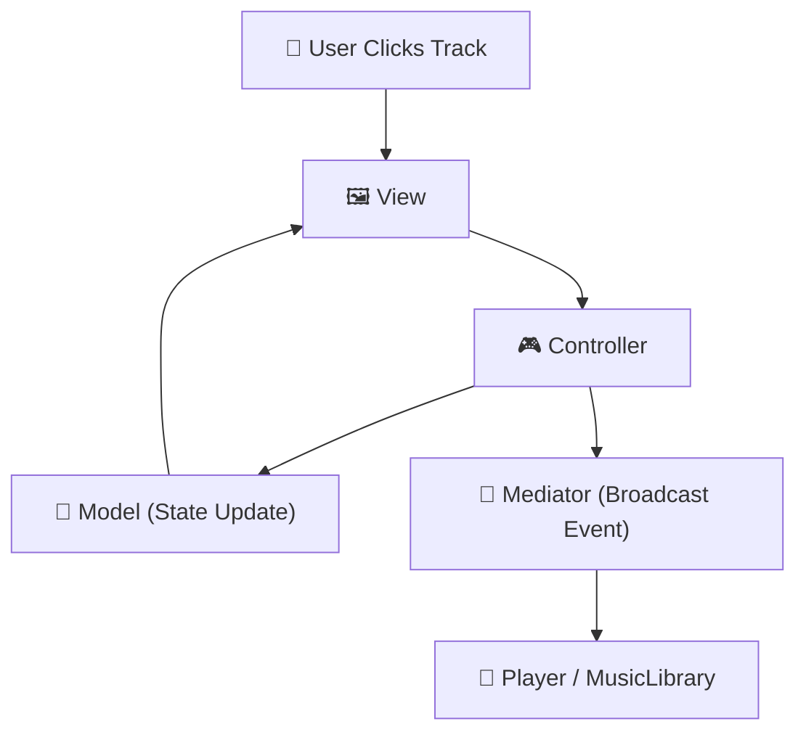

# 🏗️ Technical Architecture

This section outlines the internal structure of **Audio-256**, including project structure, core components, views.

---

## 📚 Table of Contents

- 🧩 [MVC + Mediator Architecture](#-mvc--mediator-architecture)
    - ✳️ [Overview](#️-overview)
    - 🧱 [AlbumTracks Example](#-albumtracks-example)
    - 🔁 [Interaction Flow](#-interaction-flow)
- 📁 [Project Structure](#-project-structure)
- 🚦 [App Classes](#-app-classes)
- 📦 [Core Services](#-core-services)
- 🖼 [UI Views & Features](#-ui-views--features)
- 🗂 [Data Organization](#-data-organization)
- 📦 [External Libraries](#-external-libraries)
- ▶️ [Build & Run](#️-build--run)

---

## 🧩 MVC + Mediator Architecture

**Audio-256** is built on a modular **Model–View–Controller (MVC)** foundation, enhanced by a custom **Mediator** to decouple component communication.

### ✳️ Overview
| Layer              | Role                                                                                      |
| ------------------ | ----------------------------------------------------------------------------------------- |
| **Model (M)**      | Stores UI state (e.g., selected track, current playlist, volume level)                    |
| **View (V)**       | Handles UI rendering, event binding, and layout updates                                   |
| **Controller (C)** | Coordinates state changes, user input, and service access via the `MediatorPattern`       |
| **Mediator**       | Global event dispatcher for decoupled communication between controllers and core services |

This architecture supports **high cohesion** within modules and **loose coupling** between them, enabling flexible component reuse and testing.


---

### 🧱 AlbumTracks Example

| File                           | Role                                                                                  |
| ------------------------------ | ------------------------------------------------------------------------------------- |
| `AlbumTracksViewModel.cs`      | Maintains UI state (e.g., track list, album info, selected track index)               |
| `AlbumTracksView.cs`           | Displays the UI, binds to model data, and emits user interaction events               |
| `AlbumTracksViewController.cs` | Loads data from `MusicLibrary`, responds to events, and sends commands via `Mediator` |

---

### 🔁 Interaction Flow



---

1. **View** receives UI event (e.g., Play, Add to Playlist)
2. **Controller** updates the **Model** and emits events through the Mediator
3. **Mediator** dispatches the event to the corresponding service (e.g., **Player**, **LibraryLoader**)
4. **Model** updates trigger UI changes in the **View**

---

## 📁 Project Structure

```plaintext
Audio256/
│
├── App/                                   
│   ├── AppInitializer.cs
│   ├── Program.cs
│   └── Resources/                         
│       └── ...
│
├── Core/                                  
│   ├── Player.cs
│   ├── MusicLibrary.cs
│   ├── MetadataHelper.cs
│   ├── LibraryLoader.cs
│   └── Mediator.cs   
│
└── UI/                                    
    │
    ├── MainForm/
    │   ├── Models/
    │   │   └── MainFormModel.cs
    │   ├── Views/
    │   │   └── MainFormView.cs
    │   └── Controllers/
    │       └── MainFormController.cs
    │
    ├── Shared/                            
    │   ├── NavBar/
    │   │   ├── Models/
    │   │   │   └── NavBarModel.cs
    │   │   ├── Views/
    │   │   │   └── NavBarView.cs
    │   │   └── Controllers/
    │   │       └── NavBarController.cs
    │   │
    │   ├── PlayerControlBar/
    │   │   ├── PlayerHeader/
    │   │   │   ├── Models/
    │   │   │   │   └── PlayerHeaderModel.cs
    │   │   │   ├── Views/
    │   │   │   │   └── PlayerHeaderView.cs
    │   │   │   └── Controllers/
    │   │   │        └── PlayerHeaderController.cs
    │   │   │  
    │   │   ├── PlayerBar/
    │   │   │   ├── Models/
    │   │   │   │   └── PlayerBarModel.cs
    │   │   │   ├── Views/
    │   │   │   │   └── PlayerBarView.cs
    │   │   │   └── Controllers/
    │   │   │        └── PlayerBarController.cs
    │   │   │
    │   │   └── SoundBar/
    │   │       ├── Models/
    │   │       │   └── SoundBarModel.cs
    │   │       ├── Views/
    │   │       │   └── SoundBarView.cs
    │   │       └── Controllers/
    │   │           └── SoundBarController.cs
    │   │
    │   └── SystemTrayIcon/
    │       ├── Models/
    │       │   └── SystemTrayIconModel.cs
    │       ├── Views/
    │       │   └── SystemTrayIconView.cs
    │       └── Controllers/
    │           └── SystemTrayIconController.cs
    │
    ├── Artists/
    │   ├── Models/
    │   │   ├── ArtistsViewModel.cs
    │   │   └── ArtistListThumbnailModel.cs
    │   ├── Views/
    │   │   ├── ArtistsView.cs
    │   │   └── ArtistListThumbnailView.cs
    │   └── Controllers/
    │       ├── ArtistsViewController.cs
    │       └── ArtistListThumbnailController.cs
    │
    ├── Albums/
    │   ├── Models/
    │   │   ├── AlbumsViewModel.cs
    │   │   └── AlbumListThumbnailModel.cs
    │   ├── Views/
    │   │   ├── AlbumsView.cs
    │   │   └── AlbumListThumbnailView.cs
    │   └── Controllers/
    │       ├── AlbumsViewController.cs
    │       └── AlbumListThumbnailController.cs
    │
    ├── ArtistAlbums/
    │   ├── Models/
    │   │   ├── ArtistAlbumsViewModel.cs
    │   │   └── ArtistAlbumThumbnailModel.cs
    │   ├── Views/
    │   │   ├── ArtistAlbumsView.cs
    │   │   └── ArtistAlbumThumbnailView.cs
    │   └── Controllers/
    │       ├── ArtistAlbumsViewController.cs
    │       └── ArtistAlbumThumbnailController.cs
    │   
    ├── AlbumTracks/
    │   ├── Models/
    │   │   ├── AlbumTracksViewModel.cs
    │   │   ├── AlbumTracksHeaderModel.cs
    │   │   ├── AlbumTracksListModel.cs
    │   │   └── AlbumTrackItemModel.cs
    │   ├── Views/
    │   │   ├── AlbumTracksView.cs
    │   │   ├── AlbumTracksHeaderView.cs
    │   │   ├── AlbumTracksListView.cs
    │   │   └── AlbumTrackView.cs
    │   └── Controllers/
    │       ├── AlbumTracksViewController.cs
    │       ├── AlbumTracksHeaderController.cs
    │       ├── AlbumTracksListController.cs
    │       └── AlbumTrackController.cs
    │
    ├── Playlist/
    │   ├── Models/
    │   │   ├── PlaylistViewModel.cs
    │   │   ├── PlaylistCreateButtonModel.cs
    │   │   └── PlaylistThumbnailModel.cs
    │   ├── Views/
    │   │   ├── PlaylistView.cs
    │   │   ├── PlaylistCreateButtonView.cs
    │   │   └── PlaylistThumbnailView.cs
    │   └── Controllers/
    │       ├── PlaylistViewController.cs
    │       ├── PlaylistCreateButtonController.cs
    │       └── PlaylistThumbnailController.cs
    │
    └── PlaylistTracks/
        ├── Models/
        │   ├── PlaylistTracksViewModel.cs
        │   ├── PlaylistTrackItemModel.cs
        │   ├── PlaylistHeaderModel.cs
        │   ├── PlaylistListModel.cs
        │   ├── PlaylistSearchTrackItemModel.cs
        │   └── PlaylistSearchBoxModel.cs
        ├── Views/
        │   ├── PlaylistTracksView.cs
        │   ├── PlaylistTrackItemView.cs
        │   ├── PlaylistHeaderView.cs
        │   ├── PlaylistListView.cs
        │   ├── PlaylistSearchTrackItemView.cs
        │   └── PlaylistSearchBoxView.cs
        └── Controllers/
            ├── PlaylistTracksViewController.cs
            ├── PlaylistTrackItemController.cs
            ├── PlaylistHeaderController.cs
            ├── PlaylistListController.cs
            ├── PlaylistSearchTrackItemController.cs
            └── PlaylistSearchBoxController.cs
```  

---

## 🚦 App Classes

| Class            | Role                                                                                           |
| ---------------- | ---------------------------------------------------------------------------------------------- |
| `AppInitializer` | Main startup coordinator: loads music, restores session, wires `Mediator`, and initializes views |
| `Program`        | Application entry point — calls `AppInitializer`, launches `MainForm`                          |
| `Resources`      | Shared assets (icons, fonts, static images) used throughout the UI                             |

---

## 📦 Core Services

| Class             | Role                                                                                                |
| ----------------- | --------------------------------------------------------------------------------------------------- |
| `Player`          | Manages playback (play, pause, stop, loop, volume), implemented via `NAudio`                        |
| `MusicLibrary`    | Stores all music data (artists, albums, playlists) and exposes APIs for data access                 |
| `LibraryLoader`   | Scans disk for MP3s and playlist files, loads them using `TagLibSharp`, injects into `MusicLibrary` |
| `MetadataHelper`  | Extracts tags (title, artist, album art, duration) from MP3 files                                   |
| `Mediator`        | Central publish/subscribe system that decouples components and routes events across the application |

---

## 🖼 UI Views & Features

All views are structured as Modular MVC triplets under UI/<Feature>/, e.g.,:

| View / Module    | Description                                                               |
| ---------------- | ------------------------------------------------------------------------- |
| `MainForm`       | Primary shell — hosts persistent controls (`NavBar`, `PlayerControlBar`)  |
| `Artists`        | Grid of all artists in library                                            |
| `Albums`         | Album list (cover, title) with selection logic                            |
| `ArtistAlbums`   | Albums by a selected artist                                               |
| `AlbumTracks`    | List of tracks in selected album with playback actions                    |
| `Playlist`       | Displays all user-created playlists                                       |
| `PlaylistTracks` | Track list for selected playlist with drag/drop, add/remove functionality |
| `SystemTrayIcon` | Provides background playback control and OS tray integration              |

```plaintext
UI/FeatureName/
├── Models/        // UI State & Data
├── Views/         // UI Layout and Render Logic
└── Controllers/   // Input, Logic, and Mediation
```

---

## 🗂 Data Organization

| Type      | Location                       | Format       |
| --------- | ------------------------------ | ------------ |
| MP3 Audio | `/Music/Artist/Album/*.mp3`    | File system  |
| Playlists | `/Data/Playlists/*.json`       | JSON         |
| Metadata  | Embedded ID3 tags (via TagLib) | MP3 Internal |

---

## 📦 External Libraries

| Library | Purpose |
|--------|---------|
| [NAudio](https://github.com/naudio/NAudio) | Audio playback engine |
| [TagLibSharp](https://github.com/mono/taglib-sharp) | Metadata extraction |
| [Newtonsoft.Json](https://www.newtonsoft.com/json) | Reading/writing JSON files for playlists and history |

---

## ▶️ Build & Run
1. Clone or download the repo
2. Open `Audio256.sln` in Visual Studio
3. Restore NuGet packages (NAudio, TagLibSharp, Newtonsoft.Json)
4. Build and run

✅ Requirements:
- .NET Framework 4.7.2+
- Visual Studio 2019 or later