# 🔄 Component Overview

Describes how key components of the application interact and initialize.

---

## 📚 Table of Contents

- 🔄 [Component Interaction Flow](#-component-interaction-flow)
- 🧬 [Initialization Sequence](#-initialization-sequence)

---

## 🔄 Component Interaction Flow

```mermaid
graph TD
    AppInitializer["🧭 AppInitializer"] -->|Initializes| LibraryLoader["📂 LibraryLoader"]
    LibraryLoader -->|Populates| MusicLibrary["🧠 MusicLibrary"]
    MusicLibrary -->|Provides Data To| Views["🖼️ Views"]
    Views -->|Render| UserControls["🧩 UserControls"]
    Views -->|Trigger Events| Player["🎵 Player"]
    UserControls -->|Send Actions| Player
    AppInitializer -->|Restore Session| Player
    MainForm["🖥️ MainForm"] --> NavBar["🧭 NavBar"]
    MainForm --> PlayerControlBar["🎛️ PlayerControlBar"]
    MainForm --> SystemTrayIcon["📌 SystemTrayIcon"]
    NavBar -->|Switch View| Views
    PlayerControlBar -->|Control Playback| Player
    SystemTrayIcon -->|Tray Commands| Player
```

## 🔁 1. `AppInitializer`

- Entry point of the application.
- Triggers `LibraryLoader` to scan local music and data files.
- Loads previous session state (e.g., last playlist or track).
- Constructs primary views using `MusicLibrary` data.

---

## 📂 2. `LibraryLoader`

- Scans local directories (`/Music`, `/Data`) for audio and playlist files.
- Uses `TagLibSharp` to extract:
  - Track title, album, artist
  - Duration and cover image
- Parses and builds:
  - `Artist`, `Album`, `Track`, `Playlist` objects
- Feeds structured data into `MusicLibrary`.

---

## 🧠 3. `MusicLibrary`

- Central in-memory data store for:
  - Artists and Albums
  - Tracks and Playlists
- Offers queryable APIs for views to access relevant data.
- Ensures a consistent, centralized source of truth across the app.

---

## 🖼️ 4. Views

Includes: `ArtistsView`, `AlbumsView`, `ArtistAlbumView`, `AlbumTracksView`, `PlaylistView`

- Pull data from `MusicLibrary` to display UI.
- Dynamically instantiate `UserControls`, such as:
  - `ArtistListItem`, `AlbumListItem`, `TrackListItem`, etc.
- Bind user events:
  - Selection
  - Playback
  - Playlist modification

---

## 🧩 5. `UserControls`

Path: `Views/Elements/<Domain>/`

- Reusable interactive UI components.
- Examples:
  - `PlaylistTrackItem`, `AlbumTrackItem`, `ArtistAlbumThumbnail`
- Emit user actions to relevant views or the `Player`.
- Fully encapsulated; follow MVU-like separation.

---

## 🎵 6. `Player`

- Core playback engine:
  - Play, Pause, Stop
  - Seek, Loop, Volume
- Listens to input from UI elements or views.
- Maintains current playback state and persists:
  - Last played track
  - Playback queue
- Triggered by `PlaylistView`, `AlbumTracksView`, and `UserControls`.

## 🖥️ 7. `Embedded Controls`

These are persistent UI components embedded within MainForm that handle global application behavior and act as bridges between the user interface and the core logic.

| **Control**        | **Description**                                                                            | **Interacts With** | **Role & Behavior**                                                             |
| ------------------ | ------------------------------------------------------------------------------------------ | ------------------ | ------------------------------------------------------------------------------- |
| `NavBar`           | Top navigation bar with buttons to switch between views (Artists, Albums, Playlists, etc.) | `Views`            | Handles view transitions by invoking appropriate view loading logic.            |
| `PlayerControlBar` | Bottom playback control panel showing track info, play/pause, seek, volume                 | `Player`, `Views`  | Central control for playback; reflects and controls current track state.        |
| `SystemTrayIcon`   | Adds application to system tray with right-click menu and restore/minimize                 | `Player`, OS Tray  | Enables background playback, minimize-to-tray functionality, and tray commands. |

---

## 📌 Notes

- Views depend solely on `MusicLibrary` for data access.
- Playback is isolated in `Player`, minimizing tight coupling.
- `UserControls` act as bridges between UI and logic without direct dependencies.
- Session state is restored for seamless continuity.

---

## 🧬 Initialization Sequence

```mermaid
graph TD
    AppInitializer["🧭 AppInitializer"] -->|Scan /Music & /Data folders| LibraryLoader["📂 LibraryLoader"]
    LibraryLoader -->|Extract metadata with TagLibSharp| MusicLibrary["🧠 MusicLibrary"]
    LibraryLoader -->|Populate Artists Albums Tracks Playlists| MusicLibrary
    AppInitializer -->|Initialize views with Library data| Views["🖼️ UI Views"]
    Views -->|Create UserControls like ArtistListItem AlbumListItem PlaylistItem| UserControls["🧩 UserControls"]
    UserControls -->|Play Pause Seek on interaction| Player["🎵 Player"]
    AppInitializer -->|Restore last played state from JSON| Player
    AppInitializer -->|Attach system components| MainForm["🖥️ MainForm"]
    MainForm --> NavBar
    MainForm --> PlayerControlBar
    MainForm --> SystemTrayIcon
```

