# 🔧 Component Overview

Describes how key components of the application interact and initialize.

---

## 📚 Table of Contents

- 🔄 [Component Interaction Flow](#-component-interaction-flow)
  - 🧭 [AppInitializer](#-1-appinitializer)
  - 📂 [LibraryLoader](#-2-libraryloader)
  - 🧠 [MusicLibrary](#-3-musiclibrary)
  - 🖼️ [Views](#️-4-views)
  - 🧩 [UserControls](#-5-usercontrols)
  - 🎵 [Player](#-6-player)
  - 📡 [Mediator](#-7-mediator)
  - 🖥️ [Embedded Controls](#️-8-embedded-controls)
- 📌 [Design Notes](#-design-notes)
- 🧬 [Initialization Sequence](#-initialization-sequence)

---

## 🔄 Component Interaction Flow

---

### 🧭 1. `AppInitializer`

- Application entry point.
- Bootstraps:
  - `LibraryLoader` for scanning audio and metadata
  - `MusicLibrary` with structured data
  - `Mediator ` for centralized event dispatch
- Constructs main UI views with dependencies injected.
- Attaches persistent UI components (`NavBar`, `PlayerControlBar`, `TrayIcon`).

---

### 📂 2. `LibraryLoader`

- Scans:
  - `/Music/Artist/Album/*.mp3` for audio files
  - `/Data/Playlists/*.json` for user playlists
- Uses `TagLibSharp` to extract metadata:
  - Title, album, artist, cover, duration
- Constructs structured domain models:
  - `Artist`, `Album`, `Track`, `Playlist`
- Injects results into MusicLibrary.

---

### 🧠 3. `MusicLibrary`

- Central in-memory store of all structured music data.
- Responsibilities:
  - Querying for artists, albums, tracks, and playlists
  - Providing filtered datasets to views
- Used across all view controllers for consistent state access.

---

### 🖼️ 4. Views

Located in: UI/<Domain>/Views/

- High-level feature containers:
  - `ArtistsView`, `AlbumsView`, `AlbumTracksView`, `PlaylistView`, etc.
- Pull domain-specific data from MusicLibrary.
- Instantiate and arrange UserControls.
- Bind user input to logic via their corresponding controllers.

---

### 🧩 5. `UserControls`

 Located in: UI/<Domain>/Views/Elements/

- Self-contained, reusable visual modules.
- Each component follows MVC conventions:
  - Model holds UI state
  - View handles rendering
  - Controller manages user input and logic
- Examples include:
  - `ArtistThumbnailView`, `AlbumTrackView`, `PlaylistTrackItemView`, etc.
- Report interaction (e.g., click, drag, search) by raising events to Mediator.

---

### 🎵 6. `Player`

Located in: Core/Player.cs

- Audio engine powered by NAudio
- Handles:
  - Playback, seek, loop, volume
  - Playback state persistence (e.g., last played track)
- Invoked by:
  - PlayerControlBarController
  - View Controllers (e.g., `AlbumTracksViewController`, `PlaylistViewController`)
  - Event emitters from UserControls

  ---

### 📡 7. Mediator

Located in Core/Mediator.cs

- Central event dispatcher for application-wide communication.
- Promotes loose coupling between:
  - Views
  - UserControls
  - Player
- Components subscribe to or publish messages such as:
  - `TrackSelected`, `PlayRequested`, `VolumeChanged`, `ViewChanged`
- Helps views trigger actions (like playback) without directly referencing each other.

---

### 🖥️ 8. `Embedded Controls`

Persistent UI elements embedded in MainFormView, acting as global interfaces to core functionality.

| Component          | Path                       | Interacts With    | Purpose                                                          |
| ------------------ | -------------------------- | ----------------- | ---------------------------------------------------------------- |
| `NavBar`           | `Shared/NavBar/`           | `Views`           | Switches between core views (Artists, Albums, Playlists)         |
| `PlayerControlBar` | `Shared/PlayerControlBar/` | `Player`, `Views` | Controls playback and displays track info                        |
| `SystemTrayIcon`   | `Shared/SystemTrayIcon/`   | `Player`, OS Tray | Enables minimize-to-tray, tray commands, and background playback |

---

## 📌 Design Notes

### 🔗 Decoupled Architecture
- Loose Coupling: Views, controls, and services interact indirectly via `Mediator` or shared data (`MusicLibrary`), avoiding direct dependencies.
- Event-Driven Communication: User interactions and logic responses are mediated through `Mediator`, enabling clean separation between UI and core functionality.

---

### 🧱 Modularity & Reusability
- Encapsulated UI Components: Each UserControl follows MVC separation (Model, View, Controller) and handles its own internal logic.
- Reusable Visual Elements: Controls are domain-agnostic and can be reused across multiple views (e.g., playlist and album views).
- Views as Composers: High-level views build their layout using modular UserControls, keeping UI logic organized and reusable.

---

### 🧠 Centralized Data Flow
- Single Source of Truth: `MusicLibrary` manages all structured music data and serves as the authoritative state store across the application.
- Consistent Access: All queries and lookups for music data (artists, albums, tracks, playlists) go through `MusicLibrary`, ensuring predictability.

---

### ♻️ State Management & Continuity
- Session Restoration: `AppInitializer` restores the last-used state (e.g., playback position, active view, selected track) at startup.
- Playback Persistence: `Player` maintains its current queue and track progress, supporting seamless resume across sessions.

---

## 🧬 Initialization Sequence

```mermaid
graph TD
    AppInitializer["🧭 AppInitializer"] -->|Scan /Music & /Data| LibraryLoader["📂 LibraryLoader"]
    LibraryLoader -->|Extract Metadata| MusicLibrary["🧠 MusicLibrary"]
    LibraryLoader -->|Build Domain Models| MusicLibrary
    AppInitializer -->|Create Views Using MusicLibrary| Views["🖼️ UI Views"]
    AppInitializer -->|Initialize Event Bus| Mediator["📡 Mediator"]
    Views -->|Instantiate UI Components| UserControls["🧩 UserControls"]
    UserControls -->|Raise Events| Mediator
    Views -->|Raise Events| Mediator
    Mediator -->|Dispatch to| Player["🎵 Player"]
    AppInitializer -->|Restore Playback State| Player
    AppInitializer -->|Mount UI Shell| MainForm["🖥️ MainForm"]
    MainForm --> NavBar
    MainForm --> PlayerControlBar
    MainForm --> SystemTrayIcon
```

