# 🔄 Component Overview

Describes how key components of the application interact and initialize.

---

## 📚 Table of Contents

- 🔄 [Component Interaction Flow](#-component-interaction-flow)
- 🧬 [Initialization Sequence](#-initialization-sequence)

---

## 🔄 Component Interaction Flow

## 🧭 1. `AppInitializer`

- Application entry point.
- Bootstraps:
  - `LibraryLoader` for scanning audio and metadata
  - `MusicLibrary` with structured data
  - `Player` with previous playback state
- Constructs main UI views with dependencies injected.
- Attaches persistent UI components (`NavBar`, `PlayerControlBar`, `TrayIcon`).

---

## 📂 2. `LibraryLoader`

- Scans:
  - `/Music/Artist/Album/*.mp3` for audio files
  - `/Data/Playlists/*.json` for user playlists
-Uses `TagLibSharp` to extract metadata:
  -Title, album, artist, cover, duration
-Constructs structured domain models:
  -`Artist`, `Album`, `Track`, `Playlist`
-Injects results into MusicLibrary.

---

## 🧠 3. `MusicLibrary`

- Central in-memory store of all structured music data.
- Responsibilities:
  - Querying for artists, albums, tracks, and playlists
  - Providing filtered datasets to views
- Used across all view controllers for consistent state access.

---

## 🖼️ 4. Views

Located in: UI/<Domain>/Views/

- High-level feature containers:
  - `ArtistsView`, `AlbumsView`, `AlbumTracksView`, `PlaylistView`, etc.
- Pull domain-specific data from MusicLibrary.
- Instantiate and arrange UserControls.
- Bind user input to logic via their corresponding controllers.

---

## 🧩 5. `UserControls`

 Located in: UI/<Domain>/Views/Elements/

- Self-contained, reusable visual modules.
- Each component follows MVC conventions:
  - Model holds UI state
  - View handles rendering
  - Controller manages user input and logic
- Examples include:
  - `ArtistListThumbnailView`, `AlbumTrackView`, `PlaylistTrackItemView`, etc.
- Raise events or call controller methods to invoke Player actions or update state.

---

## 🎵 6. `Player`

Located in: Core/Player.cs

- Audio engine powered by NAudio
- Handles:
  - Playback, seek, loop, volume
  - Playback state persistence (e.g., last played track)
- Invoked by:
  - PlayerControlBarController
  - View Controllers (e.g., `AlbumTracksViewController`, `PlaylistViewController`)
  - Event emitters from UserControls

## 🖥️ 7. `Embedded Controls`

Persistent UI elements embedded in MainFormView, acting as global interfaces to core functionality.

| Component          | Path                       | Interacts With    | Purpose                                                          |
| ------------------ | -------------------------- | ----------------- | ---------------------------------------------------------------- |
| `NavBar`           | `Shared/NavBar/`           | `Views`           | Switches between core views (Artists, Albums, Playlists)         |
| `PlayerControlBar` | `Shared/PlayerControlBar/` | `Player`, `Views` | Controls playback and displays track info                        |
| `SystemTrayIcon`   | `Shared/SystemTrayIcon/`   | `Player`, OS Tray | Enables minimize-to-tray, tray commands, and background playback |

---

## 📌 Design Notes

- Loose Coupling: Views and controls depend on `MusicLibrary` for data and Player for playback—no direct cross-dependencies.
- Modularity: Views use UserControls exclusively for internal UI structure, supporting high reusability.
- State Restoration: `AppInitializer` restores last session state (e.g., queue, track position) to ensure user continuity.
- Encapsulation: Each UserControl manages its own state and behavior independently via MVC triplets.

---

## 🧬 Initialization Sequence

```mermaid
graph TD
    AppInitializer["🧭 AppInitializer"] -->|Scan /Music & /Data| LibraryLoader["📂 LibraryLoader"]
    LibraryLoader -->|Extract Metadata| MusicLibrary["🧠 MusicLibrary"]
    LibraryLoader -->|Build Domain Models| MusicLibrary
    AppInitializer -->|Create Views Using MusicLibrary| Views["🖼️ UI Views"]
    Views -->|Instantiate UI Components| UserControls["🧩 UserControls"]
    UserControls -->|Trigger Playback Events| Player["🎵 Player"]
    AppInitializer -->|Restore Last Played State| Player
    AppInitializer -->|Attach UI Infrastructure| MainForm["🖥️ MainForm"]
    MainForm --> NavBar
    MainForm --> PlayerControlBar
    MainForm --> SystemTrayIcon
```

